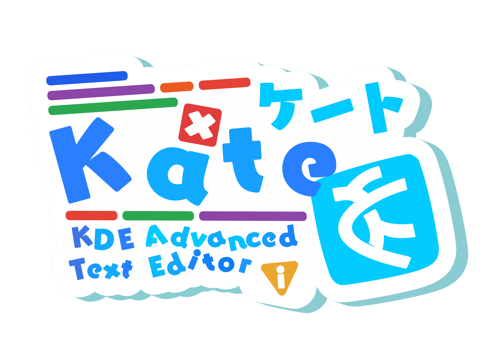

# Fun Logos
Fun logos I made.

This repo is inspired by:
https://github.com/Aikoyori/ProgrammingVTuberLogos/

## Kate
KDE Advanced Text Editor: https://kate-editor.org/

# License
This content is licensed under [CC BY-NC-SA 4.0](https://creativecommons.org/licenses/by-nc-sa/4.0/deed.en)

You can share and modify these as long as you give credit to me. You *cannot*
sell these logos. Any derivatives must be under the same license. Read the
above link for more info.
